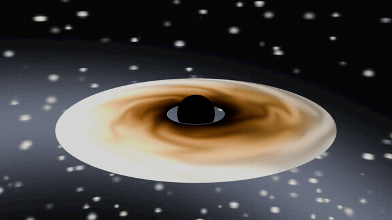

# 🕳️ gargantua-cinema — Blender

**EN:** A black hole rendered from **actual Schwarzschild geodesics**. Every pixel of the sky is a null geodesic integrated backwards through curved spacetime (RK4 on `u'' = −u + 1.5u²`): escaping rays sample the star field at their bent direction, captured rays stay black — the shadow and its lensing emerge from the math, not from a texture. The accretion disk carries **real relativistic doppler beaming**: `δ³ = (1/(γ(1−βμ)))³` brightens the approaching side and `g = √(1−1/r)` redshifts the inner edge, both computed in numpy and baked per-texel.

**TR:** **Gerçek Schwarzschild geodezikleriyle** render edilmiş kara delik. Gökyüzünün her pikseli kavisli uzay-zamanda geriye integre edilen bir null geodezik (`u'' = −u + 1.5u²`, RK4): kaçan ışın bükülmüş yönünde yıldız alanını örnekler, düşen karanlıkta kalır — gölge ve merceklenme dokudan değil matematikten çıkar. Akresyon diski **gerçek rölativistik doppler beaming** taşır: `δ³ = (1/(γ(1−βμ)))³` yaklaşan tarafı parlatır, `g = √(1−1/r)` iç kenarı kızıla kaydırır; ikisi de numpy'da hesaplanıp tek tek doku hücresine pişirilir.



*Camera descends from a wide view into the disk plane, azimuth sweeping 32°. — Kamera geniş açıdan diskin düzlemine iner, azimut 32° süpürür.*

## 🧪 The gates / Kapılar

`python3 tests/verify.py` — the integrator must reproduce Einstein's numbers:

| Gate | Ne kanıtlar / What it proves |
|---|---|
| G1 zayıf alan | Sapma 2rs/b'ye yakınsar (b=50..400, GR − düz-uzay farkı) |
| G2 foton küresi | Kritik çarpma parametresi sayısal olarak √27/2 ≈ 2.598 |
| G3 gölge bıçağı | b < b_crit düşer, b > b_crit kaçar — iki yönlü |
| G4 yıldız alanı | Tohum tekrarlanabilir, örnekleme tutarlı |
| G5 doppler | δ³ formülle birebir; yaklaşan/uzaklaşan ≥ 2× |
| G6 lens haritası | Gölge kutupta, açısal yarıçapı b_crit geometrisiyle uyumlu |

## 🎬 Render

```bash
python3 tests/verify.py                                  # kapılar (numpy yeter)
blender --background --python render_blackhole.py -- --preview   # 4 kare 640x360
blender --background --python render_blackhole.py               # 49 kare 960x540
```

**EN:** The lens map (2048×1024) is generated once per run and wired as the world environment; the black sphere marks the horizon and merges with the map's own shadow. Stars stay points — denoising is off on purpose.

**TR:** Lens haritası (2048×1024) her koşuda bir kez üretilip world environment'a bağlanır; siyah küre ufuğu işaretler ve haritanın kendi gölgesiyle birleşir. Yıldızlar nokta kalır — denoiser bilerek kapalı.

## ⚠️ Dürüstlük notu / Honesty note

**EN:** The lens map is computed for a camera at 25 rs; the cinematic camera dives to ~13.5 rs, so the backdrop's shadow angular size is approximate near the end of the dive. The dark sphere (2 rs) keeps the silhouette honest. Disk beaming is baked for the mid-clip camera azimuth (32° sweep ⇒ ±16° stale at the ends).

**TR:** Lens haritası 25 rs'deki kamera için hesaplanır; sinematik kamera ~13.5 rs'ye dalar, dalışın sonunda arka planın gölge açısal boyutu yaklaşıktır. Kara küre (2 rs) silüeti dürüst tutar. Disk beaming klip ortası azimut için pişirilir (32° süpürme ⇒ uçlarda ±16° gecikme).

## 📄 License / Lisans

MIT
